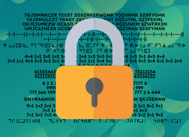

# Szyfry
Proste narzędzie do szyfrowania tekstu

https://xpawelek1211.github.io/szyfry/

---

### Szyfry dostępne w tej aplikacji:
- Zamiana (gaderypoluki)
- Zamiana góra-dół
- Alfabet Morse’a
- Czekoladka
- Tabliczka mnożenia
- Ułamki
- Szyfr komórkowy
- Karolinka
- Alfabet Galaktyczny

Żeby dowiedzieć się, jak działają poszczególne szyfry, kliknij ikonę pytajnika w aplikacji.

---

### Specyfikacja programu:
**Wejście** - tekst do zaszyfrowania  
**Wyjście** - tekst zaszyfrowany wymienionymi powyżej szyframi uwzględziając wybrane przez użytkownika ustawienia

Ze względu na ograniczenia w kluczach niektórych szyfrów, znaki inne niż litery nie zawsze zostaną zaszyfrowane. W tych przypadkach polskie litery są zamieniane na ich łacińskie odpowiedniki.

---

### Lista zmian:
**24.05.2025** - Pierwsza wersja tej aplikacji
